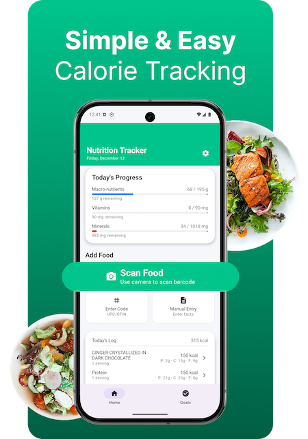

# Nutrition Tracker

**Disclosure:** *This app was created for CS 639 Mobile App Development at Pace University in Fall 2025.*

## Team
- [Anel Bazarbayeva](https://github.com/anelbazarbayeva95/CS639)
- [Spencer Maginsky](https://github.com/SpencerMaginsky1/CS639)
- [Jash Berawala](https://github.com/JashBerawala/CS639)

## About This App
NutritionTracker helps you build sustainable, healthy habits through simple and accurate food and macro tracking. Log meals in seconds, monitor your calories and key nutrients, and stay aligned with your daily goals — all in one place.
Whether you want to eat more balanced meals, improve your energy levels, or better understand what fuels your body, NutritionTracker makes mindful eating effortless.
With smart logging tools, daily summaries, and clear progress insights, you always know how your nutrition supports your goals.
**Your nutrition, simplified.**

## App Build (APK)
[Download NutritionTracker APK](https://github.com/SpencerMaginsky1/CS639Project/blob/main/NutritionTracker/app/build/outputs/apk/debug/app-debug.apk)

## Idea Proposal
We provided one concept for the app in this proposal.
[Access the full document](https://docs.google.com/document/d/1ZKc6Qso6i7H1zEfAr3XOron34Bq-oyco2D7qs0zLsSc/edit?usp=sharing)

## Design
You can view the full UI/UX design of this app on Figma:
[App Design](https://www.figma.com/design/sHoKDqTynqJLP5thdN4s3J/Focusme-app?node-id=0-1&t=l7j3yRXpGCLyJl20-1)

## Main Features
- Log meals quickly with an intuitive, clean interface  
- Track calories, macros, and nutrients with real-time progress  
- View daily, weekly, and monthly goal summaries  
- Scan food items using barcode scanning (ML Kit)  
- Access verified nutrition data with the USDA API  
- Minimal, user-friendly UI designed for fast meal tracking  
- Smart charts and daily dashboards for insights  

## Technologies
<table border="1" cellspacing="0" cellpadding="6">
  <tr>
    <th>Technology</th>
    <th>Used For</th>
    <th>Logic / How It Works</th>
  </tr>

  <tr>
    <td><b>Google ML Kit – Barcode Scanning</b> 
      (https://developers.google.com/ml-kit/vision/barcode-scanning/android)
    </td>
    <td>Scanning food package barcodes</td>
    <td>User scans a barcode → ML Kit extracts the UPC/GTIN → the app uses this code to look up the food.</td>
  </tr>

  <tr>
    <td><b>USDA FoodData Central API</b> 
      (https://fdc.nal.usda.gov/api-guide)
    </td>
    <td>Fetching nutrition data</td>
    <td>App sends the UPC to the FDC API → receives macros, vitamins, and minerals → saves it locally.</td>
  </tr>

  <tr>
    <td><b>Kotlin + Jetpack Compose</b></td>
    <td>UI and main logic</td>
    <td>Compose builds screens; Kotlin handles nutrient calculations, serving-size scaling, and state flow.</td>
  </tr>

  <tr>
    <td><b>Room Database</b></td>
    <td>Storing logged entries</td>
    <td>Each item (nutrients + portion size) is saved in Room → used for daily, weekly, monthly stats.</td>
  </tr>

  <tr>
    <td><b>DataStore (Preferences)</b></td>
    <td>User goals + settings</td>
    <td>Stores recommended daily goals and user inputs (age, sex, preferences).</td>
  </tr>

  <tr>
    <td><b>Kotlin Kandy (Charts)</b> 
      (https://kotlin.github.io/kandy/welcome.html)
    </td>
    <td>Chart visualizations</td>
    <td>Reads data from Room → creates bar charts comparing intake vs. recommended values.</td>
  </tr>

  <tr>
    <td><b>WorkManager</b></td>
    <td>Daily reminders</td>
    <td>Sends reminders to log meals or check progress even when the app is closed.</td>
  </tr>

  <tr>
    <td><b>ODPHP Nutrition Guidelines</b> 
      (https://odphp.health.gov/sites/default/files/2019-09/Appendix-E3-1-Table-A4.pdf)
    </td>
    <td>Recommended nutrient values</td>
    <td>Provides official baseline values used to calculate % of each nutrient consumed.</td>
  </tr>

  <tr>
    <td><b>Retrofit</b></td>
    <td>API communication</td>
    <td>Sends UPC requests to the USDA database and receives structured nutrition data.</td>
  </tr>
</table>

## Screenshots

<table>
  <tr>
    <td valign="top"></td>
    <td valign="top"></td>
    <td valign="top"></td>
  </tr>
  <tr>
    <td valign="top"></td>
    <td valign="top"></td>
    <td valign="top"></td>
  </tr>
</table>

## Learning Experience & Challenges

- Strengthened logical thinking through the use of callbacks and asynchronous operations.  
- Learned to integrate **CameraX with Jetpack Compose** to analyze images and process barcode data using **Google ML Kit**.  
- Further developed experience with **Retrofit** to build and query the **USDA FoodData Central (FDC) API**.  
- Improved data management skills by working with **data classes** to handle large and complex datasets.  
- Overcame system crashes and unexpected behaviors by debugging issues introduced during feature updates and refactoring.  

